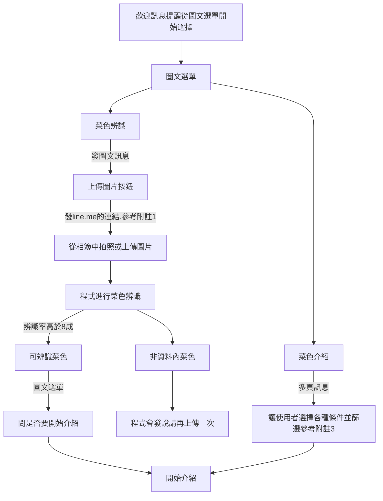
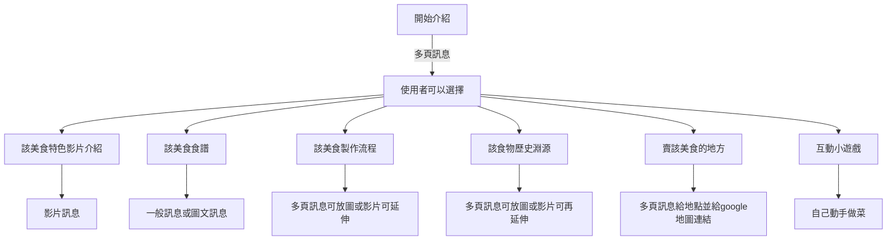

# 客家系lineBot專題

###### tags: `家教`

## 主題：
客家美食互動機器人

## 主要功能：
將客家美食拍照後上傳可以辨識他是怎樣的料理
針對美食均會提供：
* 該美食特色
* 食譜
* 製作流程影片
* 該食物的歷史淵源
* 哪些店有賣
* 互動小遊戲

## 使用技術：

* Line developer 內建關鍵字回應功能
* Python串接LineBot
* 簡易機器學習訓練與辨識菜色
* firebase 資料庫

## 如何使用：
因為程式串接無法使用雲端服務，因此只能使用程式裡的ngrok伺服器開放webhook網址，接著再使用程式自動更新message API的webhook url，大家可以正常使用。

但是如果只有一般關鍵字回應功能，仍然可以使用。

## 初步辨識與選擇菜色的架構圖：


* 附註1，如何用賴的連結去叫line做事：
https://steam.oxxostudio.tw/category/python/example/line-url-scheme.html

看你們想選哪個，都行！

* 附註2，一開始點選菜色向linebot發出的關鍵字，建議設定：
    ```
    我想知道____是什麼
    ```
    透過你們設定的關鍵字，可以拿出屬於該菜的多頁訊息。
    辨識完後，我會跳出圖文訊息(程式弄你們不用弄)，並請他們點選，並自動發送關鍵字。
    ```
    我想知道____是什麼
    ```
    ex.
    我想知道==菜包==是什麼
    
    接著就會跳出你們做的菜色的介紹多頁訊息

* 附註3
    * 酸甜苦辣鹹 選一個
    * 要不要加芹菜
    * ....

    因為只有六道，但是不要讓大家覺得我們只有六道，就透過篩選篩出他們要的菜。

## 介紹與互動的架構圖(內建進行)：


關鍵字建議可以寫成
```
我想知道_____的______
```
ex.
我想知道==菜包==的==食譜==


## 互動小遊戲

### 煮菜食譜環節
透過引導式問答，讓他們選擇煮菜步驟，接著讓他們做菜。

以客家鹹豬肉為例，讓他們選擇做菜的步驟，並透過關鍵字去跳下一個回覆。

因此你們設計的==關鍵字建議不要重複==。

因為食譜沒出來，我很難寫流程。


## 關鍵字
你們建一個記事本幫我記錄==所有==有用到的關鍵字，一行一個關鍵字。
==這個很重要。==
